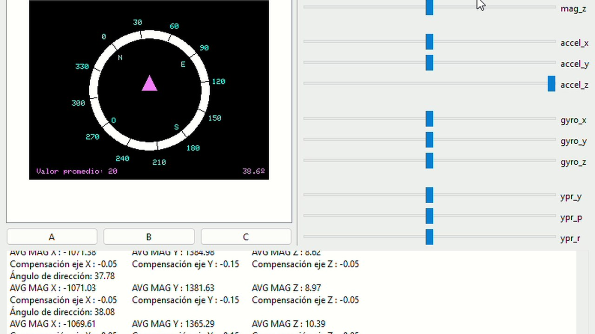

# Brújula digital con M5Stack

Brújula digital para la tarjeta M5Stack-Fire, programada en C++ con Arduino IDE sobre el magnetómetro BMM150.

## Qué hace

- Menú de calibración avanzada, con los ajustes guardados en la memoria del dispositivo.
- Filtrado digital de las medidas, configurable desde el menú.
- Interfaz de aguja fija y fondo móvil, con refresco continuo sin parpadeos.

## Cómo ejecutarlo

Abre `brujula/brujula.ino` en Arduino IDE con las librerías de M5Stack instaladas y súbelo a una M5Stack-Fire.

## Contenido

| Fichero | Qué es |
|---|---|
| `brujula/brujula.ino` | Código de la brújula |
| `Memoria.pdf` | Memoria del trabajo |
| `video.mp4` | Demostración en vídeo |

---

Trabajo final en pareja de la asignatura Interacción, Sensores y Transductores, Grado en Tecnología Digital y Multimedia (UPV). Forma parte de mi [portfolio](https://quique-such.github.io/portafolio/).
